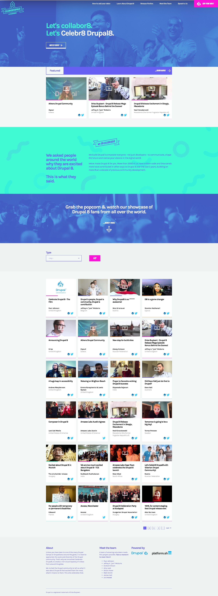
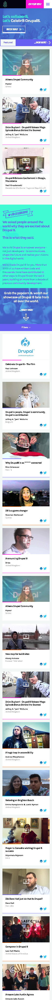
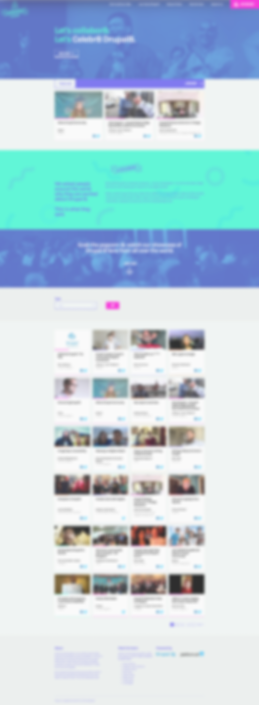
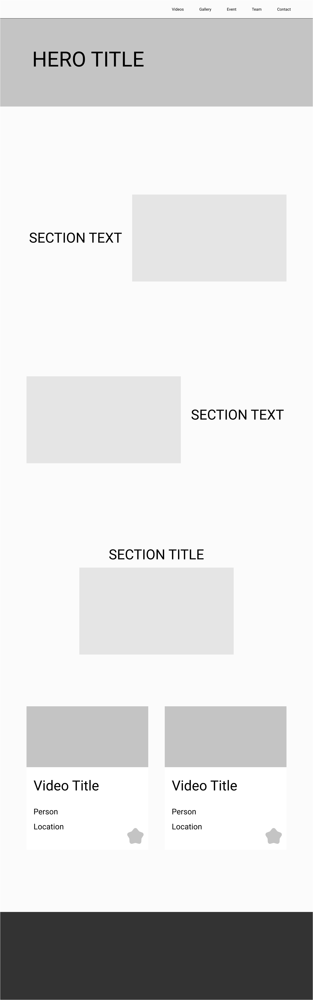
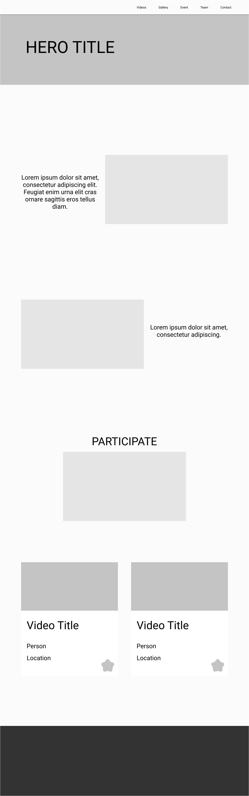
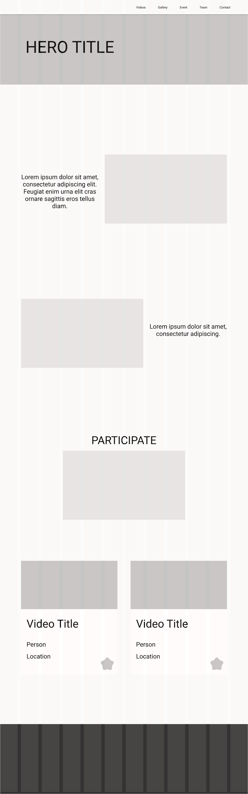
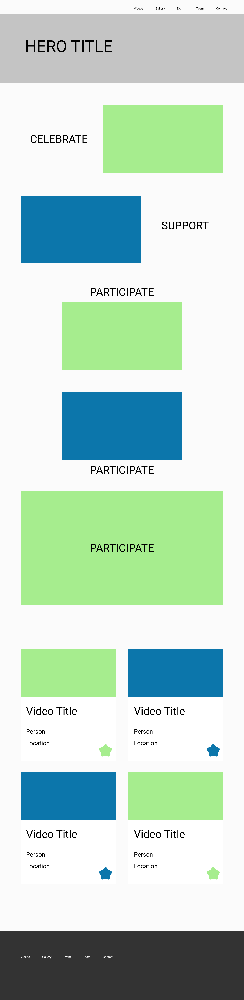
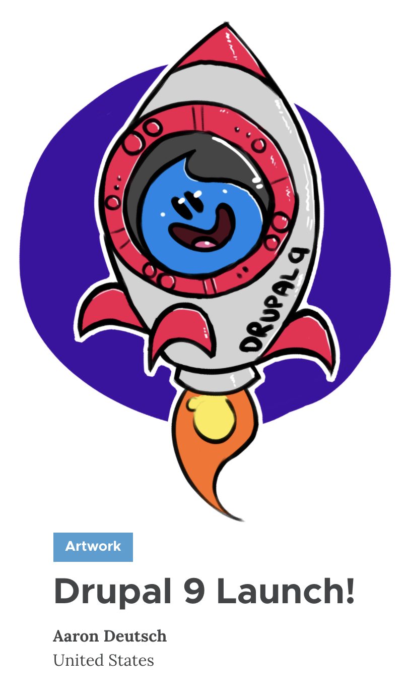

<!-- .slide: data-background="#BFDBFE" data-auto-animate data-id="welcome" -->

# Welcome

## This is the story <!-- .element: style="margin-top: 10rem" -->

## About CelebrateDrupal.org

Note: This is the story about Celebrate Drupal.

---

<!-- .slide: data-background="#BFDBFE" data-auto-animate data-id="welcome" -->

### Who am I?

# Dan Lemon <!-- .element: style="margin-top: 4rem" -->

## @dan2k3k4 <!-- .element: style="text-transform: initial; line-height: 1em;" -->

## Developer at Amazee Labs <!-- .element: style="line-height: 1em;" -->

I enjoy hip-hop,  
speaking French,  
breaking production servers,  
and snowboarding.

Note: Hi, my name's Dan Lemon. I work as a developer for Amazee Labs.

I enjoy hip-hop, speaking French, breaking production servers, and snowboarding.

---

<!-- .slide: data-background="#616568" data-auto-animate data-id="celebrate" class="center" -->

# What does it mean to celebrate?

Note: What does it mean to celebrate?

---

<!-- .slide: data-background="#616568" data-auto-animate data-id="celebrate" -->

### What does it mean to celebrate?

The definition is: <!-- .element: class="fragment" style="margin-top: 10rem" -->

Note: Have you ever stopped for a second to really think about what it means to celebrate?

---

<!-- .slide: data-background="#616568" data-auto-animate data-id="celebrate" -->

### What does it mean to celebrate?

The definition is: <!-- .element style="margin-top: 10rem" -->

> to observe a day or commemorate an event with ceremonies or festivities. <!-- .element: style="margin-top: 2rem" -->

Note: The definition is.

To observe a day or commemorate an event with ceremonies or festivities.

---

<!-- .slide: data-background="#616568" data-auto-animate data-id="celebrate" -->

### What does it mean to celebrate?

Commemorate an event with festivities. <!-- .element style="margin-top: 10rem" -->

The event? The release of Drupal 9. <!-- .element class="fragment" -->

The festivities? Well, that is what I wanted to find out. <!-- .element class="fragment" -->

Note: Commemorate an event with festivities.

The event? The release of Drupal 9.

The festivities? Well, that is what I wanted to find out.

---

<!-- .slide: data-background="#616568" data-auto-animate data-id="celebrate" -->

### What does it mean to celebrate?

Celebrations can be both: <!-- .element style="margin-top: 10rem" -->

- planned and unplanned <!-- .element class="fragment" -->
- happy and somber <!-- .element class="fragment" -->
- large and small <!-- .element class="fragment" -->

People celebrate to mark the time. 
To intentionally create a memory. <!-- .element class="fragment" style="margin-top: 4rem" -->

Note: Celebrations can be both.

Planned and unplanned: such as birthdays or a last-minute invite from a friend to catch up over drinks.

Happy and somber: somber like a funeral is a celebration of life.

People celebrate to mark the time.

To intentionally create a memory.

---

<!-- .slide: data-background="#616568" data-auto-animate data-id="celebrate" class="celebration-quote" -->

### What does it mean to celebrate?

.<!-- .element class="hidden" style="opacity: 0; margin-top: 6rem" -->

> Celebration for me means sharing a moment with others, whether it be with friends or absolute strangers.
> The shared occasion takes you to a feeling of joy and connectedness. <!-- .element style="padding: 1rem" -->

Note: Celebration for me means sharing a moment with others,

whether it be with friends or absolute strangers.

The shared occasion takes you to a feeling of joy and connectedness.

Or perhaps you're just happy when...

---

<!-- .slide: data-background="#616568" data-auto-animate data-id="celebrate" -->

### What does it mean to celebrate?

.<!-- .element class="hidden" style="opacity: 0; margin-top: 8rem" -->

> Celebration for me is when I'm able to get chocolate ice cream.

Note: Celebration for me is when I'm able to get chocolate ice cream.

---

<!-- .slide: data-background="#BFDBFE" data-background-image="./assets/ice-cream.png" data-background-size="contain" data-background-position="center bottom" data-auto-animate data-id="celebrate" -->

---

<!-- .slide: data-background="#B45309" data-auto-animate data-id="why-celebrate" class="center" -->

# Why do we celebrate?

Note: Why do we celebrate? Or better put.

---

<!-- .slide: data-background="#B45309" data-auto-animate data-id="why-celebrate" class="center" -->

# Why should we Celebrate Drupal?

Note: Why should we Celebrate Drupal?

---

<!-- .slide: data-background="#B45309" data-auto-animate data-id="why-celebrate" -->

### Why Celebrate Drupal? <!-- .element style="margin-bottom: 6rem;" -->

Drupal 9 marked the "last migration"

Code deprecation<em>\* (more on this later!)</em>

Upgraded dependencies.

We continuously raise the bar.

Note: Drupal 9 marked the "last migration", we should no longer need to do any large complex data wrangling migrations that we did to go from Drupal 7 to Drupal 8.

A lot of old code was deprecated during Drupal 8 and then removed in Drupal 9.

We upgraded a few of the main dependencies such as Symfony 3 to 4.4.

For the past 20 years, we have been continuously improving Drupal and raising the bar.

We really should celebrate this.

---

<!-- .slide: data-background="#B45309" data-auto-animate data-id="why-celebrate" -->

### Why Celebrate Drupal? <!-- .element style="margin-bottom: 6rem;" -->

I searched for any planned events for the Drupal 9 release.

However, I found nothing concrete.<!-- .element class="fragment" -->

I wanted to celebrate the launch of Drupal 9 together as a community.<!-- .element class="fragment" -->

I wanted everyone to experience a positive event in the cloud of uncertainty.<!-- .element class="fragment" -->

Note: I searched around for any planned events for the Drupal 9 release party.

However, I found nothing. I asked in Slack, and everyone was occupied with the pandemic affecting them, we were in lockdown in many countries.

I wanted to celebrate, not just because of the reasons I mentioned in the previous slide.

But also because I believe by celebrating something each day, you reinforce positive vibes and in turn other people around you may become happier as a result.

---

<!-- .slide: class="center" -->
<!-- .slide: data-background="#BFDBFE" data-id="chapter-begin" -->

### April 10th 2020

# 54 days until Drupal 9 is launched.

Note: With just 54 days until Drupal 9 is due to be launched, I did not have much time.

I needed to figure out what I want to build and how.

However, whatever I want to build is going to need some design.

---

<!-- .slide: class="center" -->
<!-- .slide: data-background="#661C0E" data-id="chapter-design" -->

### Chapter 1: Design.

# Stealing

Note: So let's jump into learning about design.

---

<!-- .slide: data-background="#661C0E" data-auto-animate data-id="chapter-design" -->

### Design

Main topics to learn:

1. Design Fundamentals <!-- .element class="fragment" -->
2. Typography <!-- .element class="fragment" -->
3. Layout <!-- .element class="fragment" -->
4. Colour Theory <!-- .element class="fragment" -->
5. Web Design <!-- .element class="fragment" -->
6. Creative Thinking <!-- .element class="fragment" -->
7. Motion Design <!-- .element class="fragment" -->
8. Prototyping <!-- .element class="fragment" -->
9. Testing <!-- .element class="fragment" -->
10. Information Architecture <!-- .element class="fragment" -->

Note: I'm not a designer, so I needed to learn the basics.

I started my quest by finding out all of the main topics.

Design Fundamentals: Heuristics of User Interface and Principles for Usable Design

Typography: Font pairing, sizing

Layout: Whitespace, composition, grid, scaling, rules (3rd, odds, golden rectangle?)

Colour Theory: Dark variants, pairing (I know there are tools, but I want to know the reasoning a little better)

Web Design: Why it's so different to print design

Creative Thinking: Stealing from other artists or techniques to get into the "creative" mindset

Motion Design: Subtle animations to draw attention

Prototyping: Wireframes to usable prototypes in black & white

Testing: Usability tests, A/B testing designs

Information Architecture: Site structure, user flow, user journey, content modelling, user guidance

---

<!-- .slide: data-background="#661C0E" data-auto-animate data-id="chapter-design" -->

### Design

I used a few tutorial websites such as: <!-- .element style="margin-top: 2em" -->

https://learnui.design <!-- .element style="color: #fff" -->

https://hackdesign.org <!-- .element style="color: #fff" -->

For creating and collaborating on the designs <!-- .element style="margin-top: 2em" -->

I decided I would use:

https://figma.com <!-- .element style="color: #fff" -->

Note: It does seem like a lot to learn to become a designer, right?

I only wanted to know the basics of each category, enough for me to understand some of the main concepts.

I felt motivated by the challenge to learn something new in a very short amount of time.

---

<!-- .slide: data-background="#661C0E" data-auto-animate data-id="chapter-design" -->

### Design

Original desktop version of CelebrateDrupal8.com <!-- .element style="margin-left: 15em; margin-top: 1em; text-align: left;" -->

Note: I took a screenshot of the original CelebrateDrupal8 project which I planned to base my designs on.

I understood that good design is about stealing other designs that work well and I felt the Drupal community were familiar enough with the original design that I could reuse it.

---

<!-- .slide: data-background="#661C0E" data-auto-animate data-id="chapter-design" -->

### Design

Original mobile version of CelebrateDrupal8.com <!-- .element style="margin-left: 10em; margin-top: 1em; text-align: left;" -->

Note: I also took the mobile version.

---

<!-- .slide: data-background="#661C0E" data-auto-animate data-id="chapter-design" -->

### Design

Squint test <!-- .element style="margin-left: 18em; margin-top: 1em; text-align: left;" -->

See what pops out <!-- .element class="fragment" style="margin-left: 18em; margin-top: 1em; text-align: left;" -->

Note: I performed a squint test on mobile and desktop, to see what popped out most from the old design.

This made me decide that I did not want to have a call to action button in the header as it distracts a bit too much on every single page.

---

<!-- .slide: data-background="#661C0E" data-auto-animate data-id="chapter-design" -->

### Design

Rough wireframe blocks <!-- .element style="margin-left: 19em; margin-top: 1em; text-align: left;" -->

Help visualise the layout structure <!-- .element class="fragment" style="margin-left: 19em; margin-top: 1em; text-align: left;" -->

Note: Rough wireframe blocks to visualise the layout structure.

---

<!-- .slide: data-background="#661C0E" data-auto-animate data-id="chapter-design" -->

### Design

Sample text length <!-- .element style="margin-left: 17em; margin-top: 1em; text-align: left;" -->

Help visualise if the blocks work well together with semi-realistic content <!-- .element class="fragment" style="margin-left: 17em; margin-top: 1em; text-align: left;" -->

Note: Add sample text to estimate the layout shifts.

---

<!-- .slide: data-background="#661C0E" data-auto-animate data-id="chapter-design" -->

### Design

Align to grid <!-- .element style="margin-left: 16em; margin-top: 1em; text-align: left;" -->

Ensure clarity and flow <!-- .element class="fragment" style="margin-left: 16em; margin-top: 1em; text-align: left;" -->

Note: Align to grid to ensure clarity and flow.

---

<!-- .slide: data-background="#661C0E" data-auto-animate data-id="chapter-design" -->

### Design

Add colour <!-- .element style="margin-left: 16em; margin-top: 1em; text-align: left;" -->

Starting to visualise the contrasting colours <!-- .element class="fragment" style="margin-left: 16em; margin-top: 1em; text-align: left;" -->

Note: Add some colour and I start to visualise how the colours will work with this layout.

---

<!-- .slide: data-background="#661C0E" data-auto-animate data-id="chapter-design" -->

### Design

Note: And here's what the design looked like before I worked on the frontend theme.

---

<!-- .slide: data-background="#661C0E" data-auto-animate data-id="chapter-design" -->

### Design

Note: And here's the final design currently in use on the website.

---

<!-- .slide: class="center" -->
<!-- .slide: data-background="#BFDBFE" data-id="chapter-begin" -->

### April 24th 2020

# 40 days until Drupal 9 is launched.

Note: Already 2 weeks had passed.

I learnt as much as I could in relation to design.

I had a repository created but it was very slim, so let's dive into.

---

<!-- .slide: class="center" -->
<!-- .slide: data-background="#4C3D13" data-id="chapter-development" -->

### Chapter 2: Development.

# Deprecation

Note: Development.

---

<!-- .slide: data-background="#4C3D13" data-auto-animate data-id="chapter-development" -->

### Development <!-- .element style="margin-bottom: 1em" -->

How to build out a Drupal website before the official launch?

Use the beta channel, or alpha if there is no beta available <!-- .element class="fragment" -->

Started in late April 2020 with: Drupal 9.0.0-beta2 <!-- .element class="fragment" -->

Keep it up to date <!-- .element class="fragment" -->

Keep contrib modules to a minimum <!-- .element class="fragment" -->

Keep custom code to a minimum <!-- .element class="fragment" -->

Note: In order to build out a Drupal 9 project before the official release

I had to use the the beta channel with release: 9.0.0-beta2

---

<!-- .slide: data-background="#4C3D13" data-auto-animate data-id="chapter-development" -->

### Development

# Tech Stack Used

- TailwindCSS ( https://tailwindcss.com <!-- .element style="color: #fff" -->)
- Laravel Mix (opinionated Webpack builder)
- Drupal 9 ( :-) )
- SQLite for local development (Lando was also available)

Note: TailwindCSS made it really easy to theme the frontend in a very short amount of time.

Laravel Mix, I suppose I did not need this as it was overkill since I only use it to build out the TailwindCSS PostCSS setup.

Drupal 9 was very stable from beta2 onwards. I think I only had one issue pop up which resulted in me filing an issue to drupal.org.

I find developing natively with just PHP and a SQLite database is faster than booting up Docker. I generally only need to use it to export site-build changes to config via drush config export.

---

<!-- .slide: class="center" -->
<!-- .slide: data-background="#BFDBFE" data-id="chapter-begin" -->

### May 19th 2020

# 15 days until Drupal 9 is launched.

Note: Up to this point in time, I had worked a lot on site-building, some backend tweaking, sample content creation, and basic theming via Tailwind CSS.

I did everything openly and regularly posted my updates to Drupal Slack.

I did have some people show interest in helping out but they were busy with work and private things.

I was fine with that, at the end of the day we're all just volunteering our own time, and I highly value every second that anyone is able to give.

---

<!-- .slide: class="center" -->
<!-- .slide: data-background="#1C490D" data-id="chapter-marketing" -->

### Chapter 3: Marketing.

# Teamwork

Note: Teamwork.

---

<!-- .slide: data-background="#1C490D" data-auto-animate data-id="chapter-marketing" -->

### Marketing

With under two weeks to Drupal 9 <!-- .element style="margin-top: 4em" -->

My original plan to launch the CelebrateDrupal.com website 1 week in advance looked bleak.

I needed support. <!-- .element class="fragment" style="margin-top: 2em" -->

Note: With just under two weeks until Drupal 9 was due to be released.

I started to realise that my goal to release the website at least 1 week in advance was looking bleak.

I needed to reach out to the community for support.

---

<!-- .slide: data-background="#1C490D" data-auto-animate data-id="chapter-marketing" -->

### Marketing

I had a few people who were interested in helping. <!-- .element style="margin-top: 4em" -->

I setup an onboarding meeting for everyone.

I then created a 5-minute video showing the current state of the project.

Note: I setup an onboarding meeting and created a 5-minute video showing the currrent state of the project.

---

<!-- .slide: data-background="#1C490D" data-auto-animate data-id="chapter-marketing" data-state="play-onboarding" -->

### Marketing <!-- .element style="margin-bottom: 1em;" -->

<video
    id="onboarding-celebrate-drupal"
    src="./assets/onboarding-celebrate-drupal.mp4"
    style="height: 36rem"></video>

Note: Here's what the project looked like 2 weeks before the launch of Drupal 9.

---

<!-- .slide: data-background="#1C490D" data-auto-animate data-id="chapter-marketing" -->

### Marketing <!-- .element style="margin-bottom: 2em;" -->

# Our Team Formed

I was so thankful to have a team of wonderful volunteers join me. <!-- .element class="fragment" -->

    

        Ashish Jain 
        Drupal Partner at AddWeb Solution 
        d.o/ mr.ashishjain 
        @AshishjainMr 
    

    

        Baddý Sonja 
        CEO and Co-Founder of 1xINTERNET 
        d.o/ baddysonja 
        @baddysonja 
    

    

        Christophe Jossart 
        Developer at Amazee Labs 
        d.o/ colorfield 
        @colorfield 
    

    

        Dan Lemon 
        Developer at Amazee Labs 
        d.o/ dan2k3k4 
        @dan2k3k4 
    

    

        Floris van Geel 
        Drupal Entrepreneur at 040Lab 
        d.o/ idevit 
        @040lab 
    

    

        Gábor Hojtsy 
        Drupal Initiative Coordinator at Acquia 
        d.o/ gábor-hojtsy 
        @gaborhojtsy 
    

    

        Miro Michalicka 
        DevOps at jobiqo 
        d.o/ mirom 
        @miromichalicka 
    

    

        Surabhi Gokte 
        Community Manager at Srijan Technologies 
        d.o/ surabhi-gokte 
        @surabhigokte 
    

    

        Suzanne Dergacheva 
        Co-founder of Evolving Web 
        d.o/ pixelite 
        @suzanne_kennedy 
    

    

        Zsofi Major 
        Project Manager at 1xINTERNET 
        d.o/ zsofimajor 
        @zsofimajor 
    

Note: I just want to highlight each member of the team. We met several times in the final week before we launched the website.

---

<!-- .slide: class="center" -->
<!-- .slide: data-background="#702459" data-id="chapter-content" -->

### Chapter 4: Content.

# Haircut

Note: Now that the website was looking good and the team were helping with marketing they needed some content to start to promote the website with.

---

<!-- .slide: data-background="#702459" data-auto-animate data-id="chapter-content" -->

### Content <!-- .element style="margin-bottom: 3em" -->

A good platform launch requires a good amount of content before the launch.

Therefore, to get the ball rolling,

I set out on a mission.

Note: In order to get the ball rolling, we needed the first video and the first photo.

So I set out on a mission to do just that.

---

<!-- .slide: data-background="#702459" data-auto-animate data-id="chapter-content" data-state="play-haircut" -->

### Content

# First video

<video
    id="haircut-deprecation"
    src="./assets/celebrating-drupal-9-a-visual-metaphor-for-code-deprecation.mp4"
    style="height: 28rem"></video>

Note: I conveniently needed a haircut and the hair salons had just reopened again for business.

And yes, upgrading to Drupal 9 is as easy as getting a haircut.

---

<!-- .slide: data-background="#702459" data-auto-animate data-id="chapter-content" -->

### Content

# First photo <!-- .element style="line-height: 1em" -->

By Kristen Pols' son,<!-- .element style="margin-left: 8em; margin-top: 9em; text-align: left;" -->

Aaron Deutsch<!-- .element style="margin-left: 8em; line-height: 0; text-align: left;" -->

Note: Kristen Pol was sharing her excitement about her sons' drawings with us that we had to ensure we would use it for our first photo on the platform.

Kristen Pols' son did many other fantastic artwork for the Drupal community.

It definitely helped get people into the spirit.

---

<!-- .slide: class="center" -->
<!-- .slide: data-background="#BFDBFE" data-id="chapter-begin" -->

### May 28th 2020

# 6 days until Drupal 9 is launched.

# We went LIVE. <!-- .element class="fragment" -->

Note: With the pressure mounting, we had our MVP ready.

We needed to go-live before noon on the 28th May as the project would be featured in the WeeklyDrop newsletter.

I finalised the theming for the frontend and tested on a few different browsers with different view-ports (mobile, tablet, desktop).

We went live at 7am, 5 hours before the hard deadline.

It was a huge success, with over 84 submissions in the first day - still 6 days before Drupal 9 was due to be launched.

---

<!-- .slide: class="center" -->
<!-- .slide: data-background="#BFDBFE" data-id="chapter-begin" -->

### May 28th 2020

# Twitter thread

### https://threadreaders.com/thread/1265891616667115520 <!-- .element style="text-transform: lowercase; font-weight: bold; font-size: 1.2em; color: #191919;" -->

Note: For the go-live, I created a Twitter thread where I retrospectively go back through the things I did to get to this achievement.

And what an achievement, something totally worth celebrating.

Let's fast forward a little in time.

---

<!-- .slide: class="center" -->
<!-- .slide: data-background="#BFDBFE" data-id="chapter-begin" -->

### June 3rd 2020

# DrupalCon Global 2020.

Note: I had always envisaged the platform would be used for various events.

I had updated the default taxonomy term for all entity types to point to DrupalCon Global 2020.

This allowed me to easily group the content for a special DrupalCon photo.

---

<!-- .slide: data-background="#326A8D" data-auto-animate data-id="chapter-drupalconphoto" -->

### #DrupalConPhoto <!-- .element style="margin-bottom: 4em" -->

# Druplicon

Note: During the first remote conference, it became evident that we all missed being able to connect in-person with each other.

I wanted to give back to the community. To enhance the platform with it's own special DrupalCon photo.

I set out to design the Druplicon logo with CSS Grid values.

The final result is.

---

<!-- .slide: data-background="#326A8D" data-auto-animate data-id="chapter-drupalconphoto" -->

### #DrupalConPhoto

#### The result for DrupalCon Global 2020

<video
    src="./assets/dconglobal-photo.mp4"
    autoplay
    style="height: 24rem"
    loop="loop"
    muted="true"></video>

Go check it out at: 
<a style="color: #fff" href="https://celebratedrupal.org/2020/drupalcon-global/photo">
    https://celebratedrupal.org/2020/drupalcon-global/photo
</a>

Note: It technically breaks down after 280 images as I had to manually write the CSS for each single row and column.

Quite a few people tweeted

---

<!-- .slide: class="center" -->
<!-- .slide: data-background="#6D28D9" data-id="chapter-future" -->

### Chapter 6: Future.

# Community

Note: What do we plan for the future?

---

<!-- .slide: data-background="#6D28D9" data-auto-animate data-id="chapter-future" -->

### Future <!-- .element style="margin-bottom: 4em;" -->

## The platform grows.

We want everyone to be able to celebrate any Drupal event on the platform. <!-- .element class="fragment" -->

With the ability to look back and see your celebrations over time via your user profile. <!-- .element class="fragment" -->

Note: TODO.

---

<!-- .slide: data-background="#6D28D9" data-auto-animate data-id="chapter-future" -->

### Future <!-- .element style="margin-bottom: 4em;" -->

## Help from

# You?

Note: Perhaps we can get help from you?

Feel free to reach out to help contribute.

Everything is open source, links to Github are in the footer of the website.

---

<!-- .slide: data-auto-animate data-id="bonus" class="center" -->

# Bonus

Note: I have a little surprise hidden.
